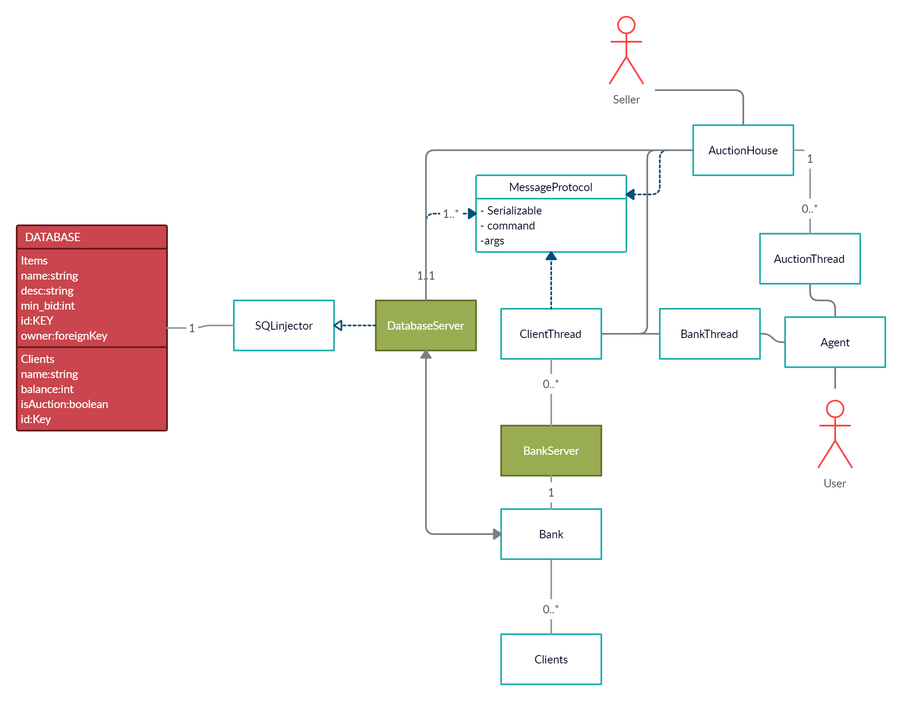
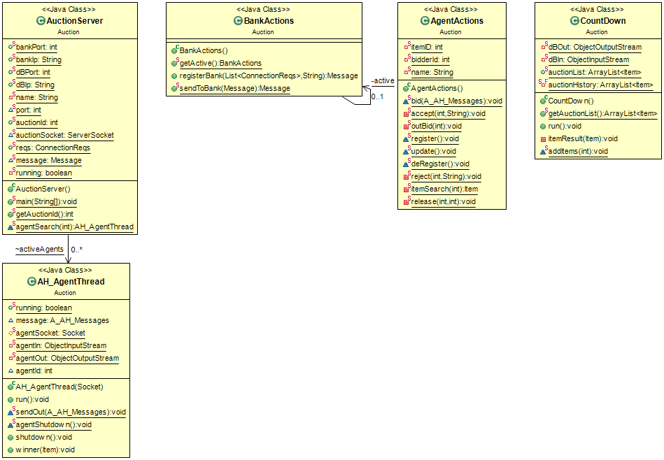
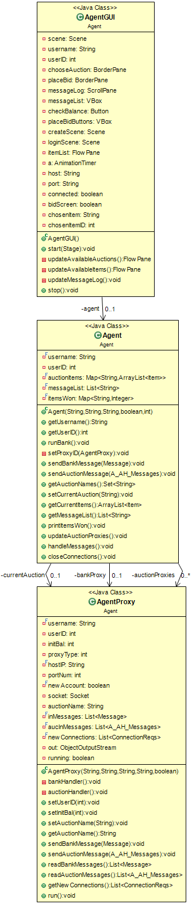

# Distributed Auction

Group Project 4 for cs 351.
Group:
Galen Hutchison
Ashley Krattiger
Ryan Cooper

## Project Structure
  
## Message System
### Error Codes
Error codes can be found on a message with FAILURE response
The accountID field will be sent with the error code  

 - -999 => Invalid Lookup  
 - -888 => Insufficient Funds 

## Bank Server 
<b>PORT: 6000</b>  
This is the main server for the program. It houses the Database and accepts concurrent connections

## Auction Server

Command line input int Auction Port, int Bank Port, String bankIp, String auction name
This is the main class fot the Auction server. 3 main threads. AuctionServer accepts input
from agents. BankActions & AgentAction are spawned from AuctionServer and perform bid and other actions for them. CountDown handles win conditions and auction list creation and maintenance.

## Agent Server

## Shared Methods

### Usage
Once connected, the bank accepts Messages which can be constructed using the shared Message class
Messages can be sent using the ObjectOutputStream:
~~~
ObjectOutputStream out = new ObjectOutputStream(socket.getOutputStream());
out.writeObject(message);
~~~
#### Commands

  
<b>OPENACCOUNT </b>     
arguments: Name (the user name), <i>optional: "auction" "port number"</i>  
Example:  
open a new user account
~~~
Message openAccountRequest = new Message.Builder()
                                        .command(Message.Command.OPENACCOUNT)
                                        .accountName("Daisy")
                                        .nullId();
~~~

<b>REGISTERHOUSE</b>  
open a new AuctionHouse account
requires: accountName, connectionReqs
Please generate a list with you ip and open port as the first element
~~~
Message newAhRequest = new Message.Builder()
                .command(Message.Command.REGISTERHOUSE)
                .accountName("AH-100")
                .connectionReqs({Your Connection Info})
                .nullId();
~~~

<b>LOGIN</b>   
requires: senderID
Use this command if you have already Created an account
and wish to use that entry in the DB
~~~
Message loginRequest = new Message.Builder()
                .command(Message.Command.LOGIN)
                .senderId(1);
~~~
RESPONSE: connectionReqs = connectionReqs of all active banks

<b>GETBALANCE</b>  
requires: accountId
returns the current balance of an active client. Failure response if client
is not in active session

RESPONSE: balance = requested balance, accountID = client id

<b>BLOCK</b>  
requires: accountId, balance
Will block the client of accountId to the amount of balance
return: SUCCESS if successful, FAILURE if client doesnt have enough funds
err= -888  
  
<b>DEPOSIT</b>
requires: accountId, balance

<b>TRANSFER</b>
requires: accountId, senderId, balance
transer balance from accountId to senderId. Will transer 0 if accountID does
not have funds

<b> DEREGISTER</b>    
Make sure to deregister before logging out. 
requires: senderID

 ## DatabaseServer
 <b>PORT: 6002 </b>
 Only the bank and Auction Houses should talk to Database
 It accepts DBMessage
 
 ### Commands
 
 <b> GET ITEM</b>  
 COMMAND: GET TABLE: ITEMS
 Requires: id

### Setting up the Database
add sqlite-jdbc-3.21.0.21.jar to classpath available from intellj package manager 
or on [their repo](https://github.com/xerial/sqlite-jdbc)

The run the script provided in the Database package called dbinitializer

voila! Your database should be good to go.

### Setting up on School computers
Computers
moons
trucks
gigs.cs.unm.edu
shuttle.cs.unm.edu
b146-[1-100]

use command:
~~~
dig +short myip.opendns.com @resolver1.opendns.com
~~~
to get ip address